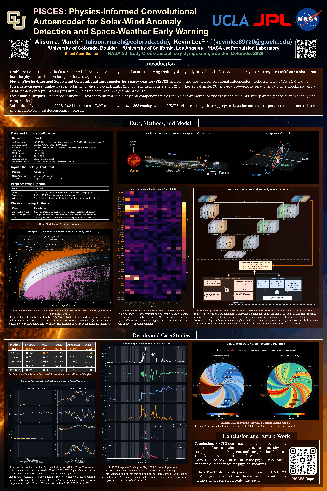

# PISCES Public Preview

PISCES is a physics-informed convolutional autoencoder for detecting anormal 60-minute solar-wind patterns near L1 Lagrange point. This preview includes our initial model, a lightweight runner, and example inputs. Full preprocessing, scoring, evaluation, training, and baselines would be released later in May 2026.

## Files

- `model/pisces_preview.pt` — exported model
- `pisces_preview/run_preview.py` — preview runner
- `examples/example_normalized_windows.csv` — small synthetic example input
- `examples/omni_may2024_preview_windows.csv` — two normalized NASA OMNI windows
- `examples/expected_preview_output.csv` — expected output for the OMNI preview input
- `presentation/Poster.pdf` — poster PDF
- `presentation/Poster.png` — poster preview image for README
- `presentation/Presentation.pdf` — presentation
- `Q&A.md` — Q&A guide
- `MODEL_CARD.md` — model summary
- `CITATION.cff` — citation metadata
- `CHECKSUMS.txt` — SHA-256 checksums

## Poster

[](presentation/Poster.pdf)

Click the image to open the full poster.

## Q&A

For details on what is included in the project, how to run it, and what will come with the full release, please refer [Q&A.md](Q&A.md).

## Install

```bash
python -m venv .venv
source .venv/bin/activate
pip install -r requirements.txt
```

## Run

Synthetic example:

```bash
python -m pisces_preview.run_preview examples/example_normalized_windows.csv --out preview_output.csv
```

NASA OMNI preview windows:

```bash
python -m pisces_preview.run_preview examples/omni_may2024_preview_windows.csv --out omni_preview_output.csv
```

Expected OMNI output is in `examples/expected_preview_output.csv`.

## Input format

Required columns:

```text
window_id,step,bx,by,bz,bt,density,speed,temperature
```

Each `window_id` must have 60 rows with `step` values `0..59`. Optional `start_utc` and `source` values must be constant within a window and are copied to the output.

Values are normalized model inputs. Raw OMNI download and preprocessing are planned for the full release.

## Verify files

```bash
sha256sum -c CHECKSUMS.txt
```

## Citation

Please cite the paper and star this repo if you find it useful. We will continue maintaining and updating this repo. Feel free to contact [**kevinlee69720@g.ucla.edu**](mailto:kevinlee69720@g.ucla.edu) and [**alison.march@colorado.edu**](mailto:alison.march@colorado.edu), or open an issue if you have any questions.

```bibtex
@inproceedings{march2026pisces,
  title={{PISCES}: Physics-Informed Convolutional Autoencoder for Solar Wind Anomaly
         Detection and Space Weather Early Warning},
  author={March, Alison J. and Lee, Kevin},
  booktitle={NASA 5th Eddy Cross-Disciplinary Symposium},
  year={2026},
  address={Boulder, Colorado}
}
```
